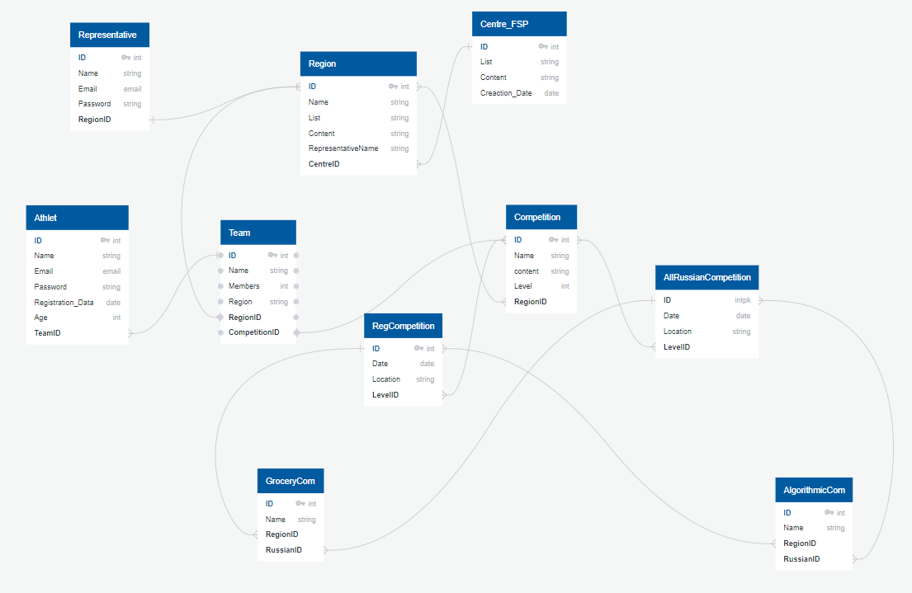

FSP проект
-
Используется postrgesql
Для запуска создайте bd postgress и установите prod requirements.
Добавьте ```.env``` в ```FSP_jestkie_programisty``` и добавьте туда поля NAME=name, USER=user, PASSWORD=passw
проипишите
```commandline
python3 manage.py makemigrations
python3 manage.py migrate
```

для парсинга есть url parse/